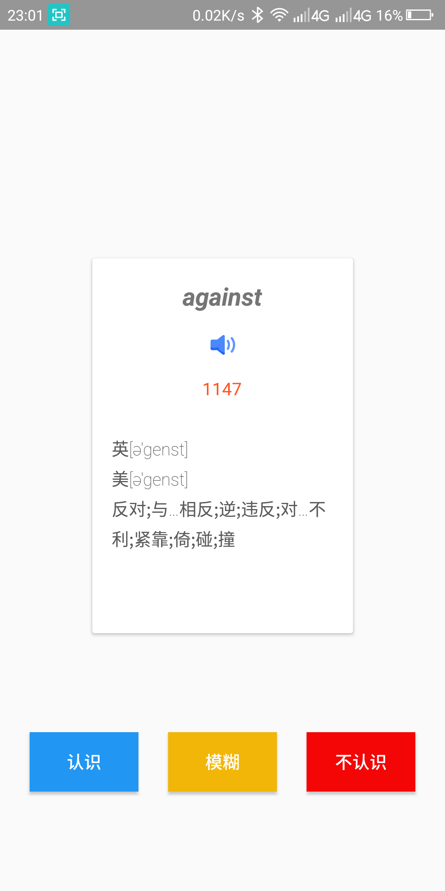
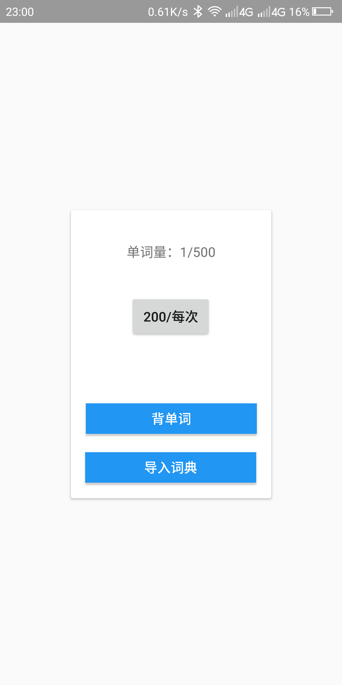
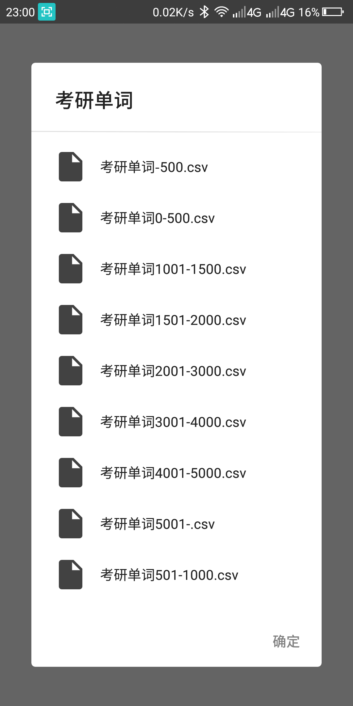

easy
=================
一个背单词的app使用Android开发，这是一个对Android Jetpack十分友好的练习。

easy开发环境比较复杂。
代码变更也许不会有反馈，如果崩溃可以尝试重新安装软件。

Introduction
------------

* app使用kotlin作为开发语言，采用MVVM设计模式。
* Android Jetpack是一套组件、工具和指南，可以用来制作出色的Android应用程序。

Screenshots
------------

Libraries Used
--------------

*[Foundation][0]-核心系统功能的组件，Kotlin扩展和对

多重索引和自动化测试。

*[AppCompat][1]-在旧版本的Android上优雅地降级。

*[Android KTX][2]-编写更简洁、惯用的Kotlin代码。

*[Test][4]-一个用于单元和运行时UI测试的Android测试框架。

*[Architecture][10]—一个库集合，帮助您设计健壮、可测试和

可维护的应用程序。从管理UI组件生命周期和处理数据的类开始

坚持不懈。

*[Data Binding][11]-声明性地将可观察数据绑定到UI元素。

*[Lifecycles][12]-创建一个自动响应生命周期事件的UI。

*[LiveData][13]-生成数据对象，当基础数据库发生更改时通知视图。

*[导航][14]-处理应用内导航所需的一切。

*[Room][16]-使用应用内对象和编译时检查访问应用程序的SQLite数据库。

*[ViewModel][17]-存储应用程序循环时未销毁的UI相关数据。轻松安排
优化执行的异步任务。

*[WorkManager][18]-管理Android后台作业。

*[UI][30]-有关为什么以及如何在应用程序中使用UI组件的详细信息-一起使用还是单独使用

*[Animations&Transitions][31]-在屏幕之间移动控件和转换。

*[Fragment][34]—可组合UI的基本单元。

*[Layout][35]-使用不同的算法布局小部件。

*第三方

*[Glide][90]用于图像加载

*[material-dialogs][91]用于文件加载 
[0]: https://developer.android.com/jetpack/components
[1]: https://developer.android.com/topic/libraries/support-library/packages#v7-appcompat
[2]: https://developer.android.com/kotlin/ktx
[4]: https://developer.android.com/training/testing/
[10]: https://developer.android.com/jetpack/arch/
[11]: https://developer.android.com/topic/libraries/data-binding/
[12]: https://developer.android.com/topic/libraries/architecture/lifecycle
[13]: https://developer.android.com/topic/libraries/architecture/livedata
[14]: https://developer.android.com/topic/libraries/architecture/navigation/
[16]: https://developer.android.com/topic/libraries/architecture/room
[17]: https://developer.android.com/topic/libraries/architecture/viewmodel
[18]: https://developer.android.com/topic/libraries/architecture/workmanager
[30]: https://developer.android.com/guide/topics/ui
[31]: https://developer.android.com/training/animation/
[34]: https://developer.android.com/guide/components/fragments
[35]: https://developer.android.com/guide/topics/ui/declaring-layout
[90]: https://bumptech.github.io/glide/
[91]: https://github.com/afollestad/material-dialogs